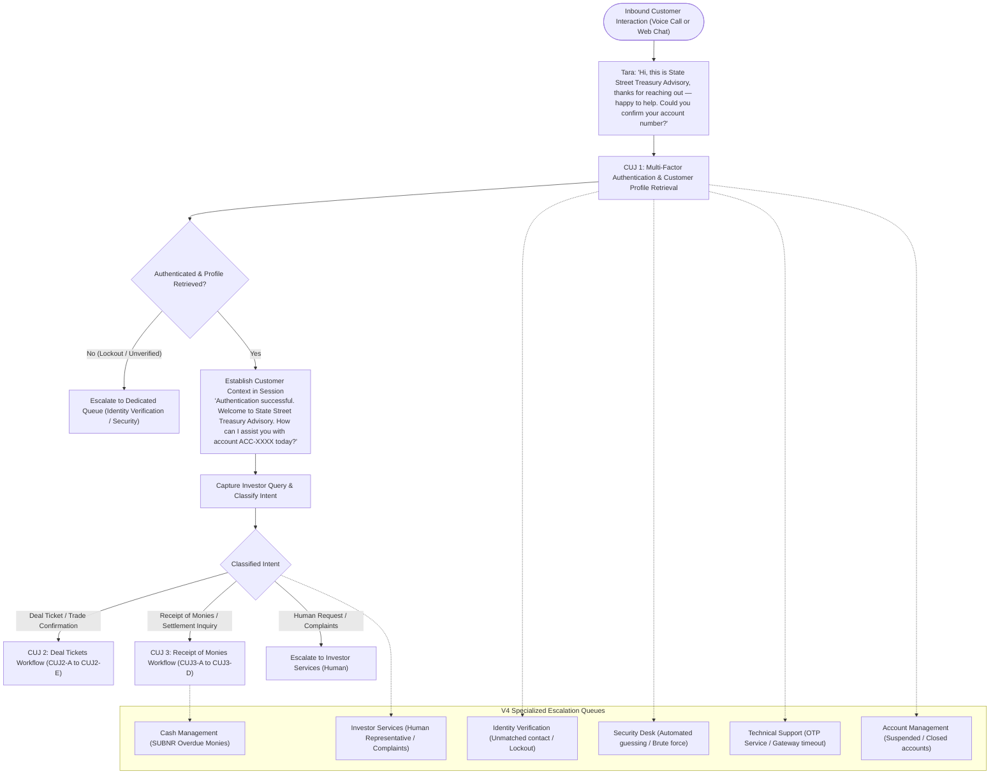
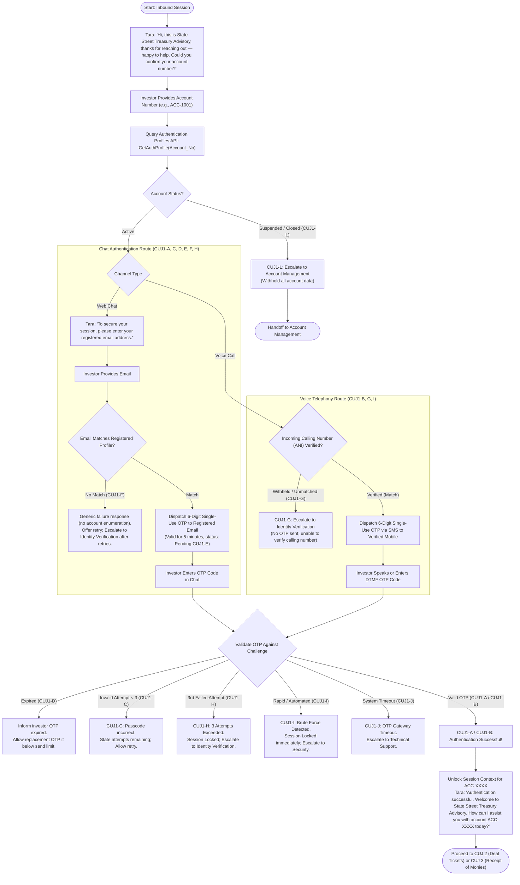
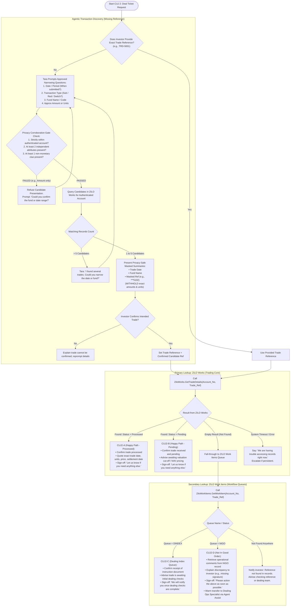

# State Street Transfer Agency AI Contact Center (GECX)
## Comprehensive Workflow Architecture for Core CUJs (V4 Specification)

This document visualizes the complete conversational and systems execution flows for the three core Customer User Journeys (CUJs) in scope for the **State Street GECX POC** (targeted for demo on October 5, 2026), updated to adhere strictly to the **SS Comprehensive Agent Build Requirements V4**.

---

## 1. High-Level Master Flow: End-to-End Orchestration

The master flow shows how an inbound interaction through either Voice (Inbound Telephony) or Chat (Web Widget) transitions from **CUJ 1: Authentication** into Intent Classification, and routes to **CUJ 2: Deal Tickets** or **CUJ 3: Receipt of Monies**, with specialized routing across **6 Dedicated Escalation Queues**.

---

## 2. CUJ 1: Investor Authentication & Customer Profile Flow (V4 Multi-Factor OTP)

Authentication is the mandatory entry gate. No transactional or financial information can be queried or disclosed prior to successful verification. Per V4, Chat and Voice diverge in their OTP delivery and validation mechanism.

---

## 3. CUJ 2: Deal Tickets (Trade Inquiry / Confirmation) Flow

This journey handles requests regarding submitted trade instructions (subscriptions, redemptions, switches). It features **Agentic Multi-Turn Discovery** when the Trade Reference is unknown, and dual-system lookup across **ZILO Works** (trading) and **ZILO Work Items** (queues).

---

## 4. CUJ 3: Receipt of Monies (Settlement Inquiry) Flow

This journey determines whether subscription monies or wire payments have been received, matched, and settled. It performs a multi-system cross-reference between **ZILO Trades** and the **Bank Reconciliation** database (including the daily **SUBNR** outstanding monies exception file).

```mermaid
flowchart TD
    StartCUJ3(["Start CUJ 3: Receipt of Monies Query"]) --> CheckSettlementRef{"Does Investor Provide Trade / Payment Ref?<br/>(e.g., TRD-5010)"}
    
    %% AGENTIC SETTLEMENT DISCOVERY
    subgraph Discovery3 ["Agentic Settlement Discovery (Missing Reference)"]
        CheckSettlementRef -- "No" --> GatherPaymentClues["Tara Prompts Approved Narrowing Questions:<br/>• Approximate date payment sent / value date?<br/>• Fund name or share class?<br/>• Approximate wire / subscription amount?"]
        GatherPaymentClues --> Gate3{"Privacy Corroboration Gate Check:<br/>• Authenticated account only?<br/>• Amount alone cannot query Bank Rec<br/>• At least 2 clues with 1 non-monetary?"}
        
        Gate3 -- "FAILED (Amount only)" --> BlockBankRec["BLOCK Bank Rec Query.<br/>Tara: 'Do you remember the fund or when the payment was sent?'"] --> GatherPaymentClues
        Gate3 -- "PASSED" --> SearchBoundedZilo["Search qualifying candidate trades in ZILO for Account"]
        
        SearchBoundedZilo --> PresentCandidatePayment["Present Privacy-Safe Summary:<br/>• Value Date<br/>• Fund Name<br/>• Masked Ref (***5110)<br/>(WITHHOLD bank details, exact amounts)"]
        
        PresentCandidatePayment --> ConfirmTradeCandidate{"Investor Confirms Intended Subscription?"}
        ConfirmTradeCandidate -- "No" --> RepromptPay["Unable to identify payment; offer specialist transfer"]
        ConfirmTradeCandidate -- "Yes" --> CheckPreSettlement{"Is Trade in 'Pending' State in ZILO?"}
        CheckPreSettlement -- "Yes (e.g., TRD-5113)" --> ExplainPreSettled["Explain trade is still pending execution;<br/>Monies not yet due for reconciliation.<br/>Do NOT query Bank Rec."]
        CheckPreSettlement -- "No (Qualifying Trade)" --> SetCUJ3Ref["Set Confirmed Trade Reference"]
    end
    
    CheckSettlementRef -- "Yes" --> SetCUJ3Ref
    
    %% RECONCILIATION & SETTLEMENT ENGINE
    subgraph SettlementEngine ["Settlement & Cash Reconciliation Engine"]
        SetCUJ3Ref --> QueryZiloTrade["Call Zilo.GetTrade(Account_No, Trade_Ref)"]
        QueryZiloTrade --> ZiloSettlementState{"ZILO Settlement State"}
        
        ZiloSettlementState -- "Status = Settled" --> QueryBankRecMatched["Query Bank Rec: Status = Matched"]
        QueryBankRecMatched --> Outcome3A["CUJ3-A (Happy Path - Settled & Matched):<br/>• Confirm monies received and trade settled<br/>• Quote exact matched amount and received value date<br/>• Sign-off: 'Let us know if you need anything else.'"]
        
        ZiloSettlementState -- "Status = Unsettled" --> QueryBankRecUnsettled["Query Bank Rec & Check SUBNR File"]
        
        QueryBankRecUnsettled --> SUBNRCheck{"SUBNR Flag & Settlement Date"}
        
        SUBNRCheck -- "Bank Rec = Unmatched & SUBNR = No (Within Cycle)" --> Outcome3B["CUJ3-B (Not Yet Due / Monitoring):<br/>• Funds not yet matched; within normal settlement cycle<br/>• Tara: 'We are monitoring the daily bank reconciliation file and will confirm receipt once funds arrive.'"]
        
        SUBNRCheck -- "Bank Rec = Unmatched & SUBNR = Yes (SD+1 Overdue)" --> Outcome3C["CUJ3-C (Overdue Settlement - Urgent Escalation):<br/>• Flagged on SUBNR as outstanding past Settlement Date + 1<br/>• Tara: 'This has been escalated to our Cash Management team. We will update you as soon as we have news.'<br/>• Immediate High-Priority Escalation to Cash Ops with auto-summary"]
        
        ZiloSettlementState -- "Trade Not Found" --> ErrNotFound["Advise investor trade record not found; verify reference"]
    end
```

---

## 5. Summary Comparison of the 3 CUJs

| Dimension | **CUJ 1: Authentication & Profile** | **CUJ 2: Deal Tickets** | **CUJ 3: Receipt of Monies** |
| :--- | :--- | :--- | :--- |
| **Primary Systems** | Authentication Service, Zilo Profile API | ZILO Works (Trading), ZILO Work Items (Queues) | ZILO Trades, Bank Reconciliation, SUBNR File |
| **Key Personas** | Tara (Agent), Investor / Representative | Tara (Agent), Dealing Operations Specialist | Tara (Agent), Cash Management Operations |
| **Core Happy Path** | Identity verified; personalized context set | **CUJ2-A:** Trade Processed in ZILO Works | **CUJ3-A:** Settled in ZILO + Matched in Bank Rec |
| **Pending / In-Flight** | Re-prompt credentials (up to 3 attempts) | **CUJ2-B:** Pending valuation / NAV cut-off | **CUJ3-B:** Unsettled + Unmatched + SUBNR No |
| **Operational Queue** | N/A | **CUJ2-C:** DINDEX queue (awaiting checks) | N/A (Handled via Bank Rec cycle) |
| **Exception Escalation** | 3 Failed attempts $\rightarrow$ Live Agent handoff | **CUJ2-D:** NIGO queue $\rightarrow$ Live Dealing transfer | **CUJ3-C:** SD+1 SUBNR Yes $\rightarrow$ Cash Mgmt escalation |
| **Agentic Discovery** | Mandatory for unauthenticated callers | Clues corroborate masked candidate (`***5102`) | Amount alone blocked; confirm trade before Bank Rec |
