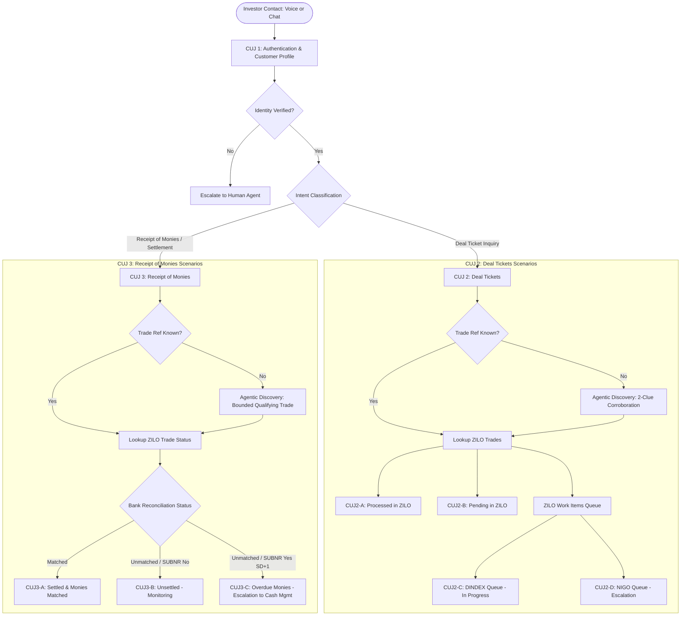

# State Street Transfer Agency AI Contact Center POC (GCEX)
## Comprehensive Technical & Project Findings Report

**Prepared for:** Shashank Tilwalli (`stilwalli@google.com`), Google Cloud Conversational AI Specialist  
**Date:** September 21, 2026  
**Customer:** State Street Corporation — Transfer Agency (TA)  
**Sponsors & Key Stakeholders:** Sriram Piratla (VP Data & AI, State Street), Mark Healy (Business Sponsor / Product, State Street), Ali Naib (PM / Scrum Master, State Street), Michael Demers (Cloud / IAM, State Street), Rob Cox (GCEX Sales Specialist, Google Cloud), Hussein Sharif (Google Cloud)

---

## Executive Overview & Context

Shashank Tilwalli returned from training/OOO (September 15–17, 2026) on Monday, September 21, 2026. On the morning of September 21, Sriram Piratla (State Street VP Data & AI) scheduled a kickoff call with Rob Cox, Shashank, and the broader engineering/SME team to address outstanding queries and initiate the build of conversational agents and flows on the **Google Cloud Customer Engagement Suite (GCEX / GECX / CX Agent Studio)** platform.

Attached to Sriram's September 21 kickoff invite were the newly finalized, reconciled agent instruction specifications and mock datasets:
1. `CUJ_2_Deal_Tickets_Agent_Instructions_Complete_Agentic_Discovery.md`
2. `CUJ_3_Receipt_of_Monies_Agent_Instructions_Complete_Agentic_Discovery.md`
3. `GCEX_Mock_Data_CUJ_Aligned_Agentic_Discovery_Reconciled.xlsx`

This report synthesizes the entire project repository located at `/usr/local/google/home/stilwalli/mywork/statestreet_research/`, establishing clear alignment across scope, architecture, agent persona, test scenarios, authoritative sources of truth, and critical immediate tasks.

---

## 1. Project & POC Goals

### 1.1 Context and Business Drivers
State Street’s Transfer Agency (TA) division manages investor servicing, subscription/redemption operations, trade execution, and cash reconciliation across retail and institutional funds. Currently, operations rely on manual handling and legacy mainframe/on-premise platforms:
- **iFAST**: Legacy core recordkeeping and shareholder accounting system.
- **AWD (Automated Work Distributor)**: Legacy workflow management and image/work item routing queue system.
- **VBS / ETA / Spreadsheets**: Manual daily bank reconciliation files and SUBNR (Subscription Not Received / Outstanding Monies) tracking.

These legacy systems create significant operational friction: high inquiry call volumes, slow turnarounds for transaction confirmations, manual cross-system swivel-chair lookups, and elevated risk during settlement exceptions.

### 1.2 The Transformation: Transition to ZILO & Zilo Work
State Street is actively modernizing its transfer agency architecture by migrating from iFAST/AWD to **ZILO / Zilo Work**:
- **ZILO (Zilo Works)**: Cloud-native fund administration, transaction execution, and investor recordkeeping platform.
- **Zilo Work (ZILO Work Items)**: Next-generation workflow management and queue orchestration (replacing AWD queues such as DEALING, DINDEX, and NIGO).

### 1.3 Role of Google Cloud GECX (Customer Engagement Suite)
Google Cloud’s GECX (incorporating CX Agent Studio / CXAS, Conversational Agents / Dialogflow CX, Agent Assist, and CCAI Insights) acts as the intelligent conversational layer positioned above the enterprise backends. GECX:
- Fronts customer engagements across both Voice and Chat channels.
- Shields investors from backend architectural complexity.
- Performs conversational intent classification, entity extraction, and agentic multi-step discovery.
- Enforces strict compliance and data privacy guardrails.
- Routes to ZILO (or dual-source routing with AWD/iFAST for unmigrated funds).
- Provides live Agent Assist context and summaries upon escalation, alongside real-time contact center operational analytics via CCAI Insights.

### 1.4 Timeline & Milestone Deadlines
The POC runs across an intensive 4-week engagement structured into three sprints:
- **Sprint 1 (Sep 7 – Sep 18):** Discovery, scoping, mock data creation, OpenAPI specs, and knowledge gathering.
- **Sprint 2 (Sep 21 – Oct 2):** Conversational agent build in GCEX/CXAS, integration stubs, Agent Assist configuration, end-to-end testing, and executive dashboard setup.
- **Sprint 3 (Week of Oct 5):** Dry run rehearsals and final **Executive Presentation on Monday, October 5, 2026**.

---

## 2. Use Cases & Agent Specifications

### 2.1 Channels: Voice and Chat Parity
The solution targets dual-channel delivery with functional parity:
- **Voice Channel:** Inbound telephony via GECX Voice Gateway / Telephony runtime (US region for the demo). Handles real-time speech-to-text, low-latency agent reasoning, and natural text-to-speech.
- **Chat Channel:** Web-based messenger widget embedded in the investor self-service portal.
- **Architectural Rule:** Voice and Chat are **channels**, not distinct CUJs. Both channels invoke the exact same underlying conversational agent logic, business rules, privacy controls, and API integrations.

### 2.2 Agent Persona: "Tara"
Across both channels, the agent embodies the persona **Tara — GCEX Investor Services Assistant**:
- **Tone & Demeanor:** Professional, calm, precise. Regulated fund administration requires that *accuracy always outranks friendliness*.
- **Stylistic Constraints:** Strictly **no exclamation marks** and **no emojis**. Concise and factual; never pads responses with conversational filler.
- **Personalization:** Warm but not over-familiar; greets investors acknowledging firm name where known.
- **De-escalation:** If an investor is frustrated or distressed, Tara acknowledges it **exactly once** (*"I understand this is frustrating."*) and immediately proceeds calmly with the facts without looping or over-apologizing.
- **Financial Urgency:** Money queries are time-sensitive; Tara is direct about status and never hedges or softens an overdue situation.

### 2.3 Backend Integration Architecture: Mock/Stub vs. Live Zilo
- **Strategy:** To ensure stability for the October 5 demo, the POC utilizes a realistic mock/stub service backed by approved test datasets (`GCEX_Mock_Data_CUJ_Aligned_Agentic_Discovery_Reconciled.xlsx`).
- **Live Connectivity Scope:** Limited live Zilo API calls may be attempted for authentication, authorization, and basic customer profile retrieval, while trade and settlement data will be served by high-fidelity mock APIs.
- **Systems Represented:**
  1. *Accounts / Customer Profile:* Investor demographics, account numbers, authorized contacts.
  2. *ZILO Works Trades:* Transaction records (Trade Ref, Fund Code, ISIN, Trade Type, Trade Date, Status: Processed, Pending, Settled, Unsettled).
  3. *ZILO Work Items:* Workflow queues (`DEALING`, `DINDEX`, `NIGO`, `AUDIT`).
  4. *Bank Reconciliation:* Daily bank rec file entries (Expected Amount, Value Date, Bank Rec Status: `Matched`, `Unmatched`, `SUBNR` flag).

### 2.4 Sentiment Analysis, Routing & Escalation
- Real-time sentiment tracking monitors investor frustration.
- **Mandatory Escalation Triggers:**
  1. *Explicit Human Request:* Investor asks for a representative at any point.
  2. *Identity Failure:* Verification fails after allowed attempts.
  3. *Repeated Errors:* System timeouts or 5xx failures.
  4. *Queue State NIGO (CUJ 2):* Trade is in Not In Good Order queue requiring manual operational review of comments.
  5. *Overdue Settlement / SUBNR (CUJ 3):* Settlement Date + 1 reached and flagged on SUBNR outstanding file -> immediate escalation to Cash Management.
  6. *Unresolved Exception:* Wire transfer mismatch or missing bank rec record.
- **Agent Assist Hand-off:** On escalation, the agent automatically passes conversation history, structured case notes, customer context, and recommended next actions to the live human agent desktop.

---

## 3. Customer User Journeys (CUJs) & Evolution

### 3.1 Journey Evolution & Scoping Decisions
During Sprint 1, the scoping evolved significantly through stakeholder alignment:
- **Dropping Statement Request:** Initially proposed as Core Journey 2 in early drafts (and Jira TO8045-47), Statement Request was formally removed during the September 14 checkpoint (recorded in `AI_Contact_Center_Plan.xlsx` issue I011). Business documentation confirmed that statement and contract note inquiries are migrating rapidly to digital self-service portal downloads.
- **Nomenclature Standardization (Rob Cox Feedback):** Early documents listed Voice and Chat as separate "Core Journeys" (Journeys 4 and 5). Rob Cox clarified that Voice and Chat are **delivery channels**, not customer journeys. Ali Naib and Mark Healy updated the framework to reflect 3 functional journeys across 2 channels.
- **Broader Catalog (7 to 10 Journeys):** The Transfer Agency Top 10 Queries catalog includes:
  1. *Deal Ticket Receipt* (POC Scope)
  2. *Holding Balance Inquiry* (Deferred)
  3. *Statement Request* (Dropped / Digital Portal)
  4. *Distribution / Dividend Inquiry* (Deferred)
  5. *Static Data / Address Change* (Deferred)
  6. *Transfer of Shares* (Deferred)
  7. *Receipt of Monies / Settlement* (POC Scope)
  8. *Contract Note Status* (Dropped)
  9. *Trade Date Confirmation* (Merged into Deal Tickets)
  10. *Corporate Actions* (Deferred)
- *Why only these 3 for POC?* Focusing on Authentication, Deal Tickets, and Receipt of Monies provides maximum demonstration of end-to-end complexity within the tight 3-week window: multi-system lookups, queue processing (DINDEX/NIGO), cross-system bank cash reconciliation, and agentic multi-turn discovery.

### 3.2 The 3 Core Functional CUJs in POC Scope



#### CUJ 1: Investor Authentication & Customer Profile (Foundational)
- **Role:** Mandatory gate before disclosing any account-level or transactional information.
- **Workflow:** Caller/Chatter provides Account Number and security verification details (registered email, phone, or MFA answer).
- **Outcome:** Agent authenticates identity, queries Zilo Customer Profile API, establishes customer context, and greets the investor: *"I've verified your identity and pulled up your account. How can I help you today?"*

#### CUJ 2: Deal Tickets (Trade Confirmation Request)
- **Scope:** Inquiries regarding whether a recent deal/trade has been placed, confirmed, or processed.
- **Deterministic Scenarios:**
  - **CUJ2-A (Processed):** Trade found in ZILO Works with status `Processed` (e.g., ACC-1001, TRD-5001). Tara returns trade date, units, price, and confirms processing.
  - **CUJ2-B (Pending):** Trade found in ZILO Works with status `Pending` (e.g., ACC-1002, TRD-5002). Tara informs the investor the trade has been received and is awaiting dealing valuation cut-off.
  - **CUJ2-C (Work Items - DINDEX):** Trade not in ZILO, located in ZILO Work Items dealing queue under `DINDEX` (e.g., ACC-1003, TRD-5003). Tara confirms receipt; trade is indexed and awaiting dealing checks.
  - **CUJ2-D (Work Items - NIGO):** Trade located in ZILO Work Items under `NIGO` (Not In Good Order) (e.g., ACC-1004, TRD-5004). Tara checks NIGO work item comments, informs the investor of the specific discrepancy, and initiates live escalation.
- **Agentic Discovery Scenarios (Missing/Uncertain Trade Reference):**
  - **CUJ2-DISC-01 (Corroboration Gate Fail):** Investor provides only an approximate monetary amount (*"around $10,000"*). Corroboration gate fails (1 clue). Tara asks for date, fund, or transaction type; **never discloses candidate details**.
  - **CUJ2-DISC-02 (Corroboration Gate Pass):** Investor provides fund + approximate date + amount (*"Global Growth Fund, Friday, around $10,000"*). Corroboration gate passes (3 independent clues). Tara presents masked candidates (`***5102`), withholding exact amount and unit count until investor confirms.
  - **CUJ2-DISC-03 (Strict Account Partition):** System strictly filters candidate trades to the authenticated account (`ACC-1001`), excluding closer matches on other accounts (`ACC-1024`).

#### CUJ 3: Receipt of Monies (Settlement Inquiry)
- **Scope:** Inquiries regarding whether subscription funds or incoming wire transfers have arrived, cleared, and settled.
- **Deterministic Scenarios:**
  - **CUJ3-A (Settled & Matched):** ZILO status is `Settled` and Bank Rec status is `Matched` (e.g., ACC-1020, TRD-5010). Tara confirms receipt of funds, quoting exact amount and settlement value date.
  - **CUJ3-B (Unsettled & Monitoring):** ZILO status is `Unsettled`, Bank Rec status is `Unmatched`, and `SUBNR` is `No` (e.g., ACC-1021, TRD-5011). Tara advises funds have not yet arrived, notes settlement date is still pending, and advises on daily bank rec file timing.
  - **CUJ3-C (Overdue Settlement / SUBNR Escalation):** ZILO status is `Unsettled`, Bank Rec status is `Unmatched`, `SUBNR` is `Yes`, and settlement is at Settlement Date + 1 (SD+1) (e.g., ACC-1022, TRD-5012). Tara explains the payment is flagged on the outstanding monies register and transfers the call immediately to Cash Management.
- **Agentic Discovery Scenarios (Missing/Uncertain Reference):**
  - **CUJ3-DISC-01:** Single approximate payment clue (*"around $1M"*) fails gate. Tara does **not** query Bank Rec; prompts for fund or date.
  - **CUJ3-DISC-02:** Corroborated clues (*"Diversified Fund, Friday, around $1M"*) identify qualifying trade candidates. Tara confirms candidate before querying Bank Rec.
  - **CUJ3-DISC-03:** Identified qualifying candidate is in `Pending` pre-settlement state. Tara explains the trade has not reached its settlement cycle; Bank Rec query is suppressed.

---

## 4. Success Criteria

### 4.1 Functional Success Criteria by Customer Journey
| Customer Journey | Functional Success Criteria | Target Outcome |
| :--- | :--- | :--- |
| **CUJ 1: Authentication & Profile** | Investor identity verified via multi-factor attributes. Profile retrieved from Zilo/mock immediately. Personalized context established. | Agent greets investor by name/firm and states account is ready for servicing. |
| **CUJ 2: Deal Tickets** | Accurate retrieval across Zilo Trades and Work Items queues (Processed, Pending, DINDEX, NIGO). Agentic discovery enforces 2-clue privacy corroboration before candidate disclosure. | Correct trade status returned without manual intervention; NIGO escalates cleanly. |
| **CUJ 3: Receipt of Monies** | Multi-system reconciliation across Zilo and Bank Rec. Correct discrimination between Matched, Unmatched, and SUBNR states. Gated Bank Rec search. | Settlement status confirmed; SD+1 SUBNR automatically escalates to Cash Management. |
| **Voice AI Experience** | Natural conversational dialogue over telephony, sub-second latency, zero call drops, accurate STT/TTS. | Investor completes end-to-end transaction inquiry via phone. |
| **Chat AI Experience** | Portal widget delivers exact same business outcomes and validation rules as voice. | Investor completes inquiry via web chat seamlessly. |
| **Smart Routing & Escalation** | Frustration/sentiment signals detected; complex exceptions hand off to human agents with full context. | Zero dead ends; context auto-transferred to live agent screen. |

### 4.2 Non-Functional Capability Rankings (Mark Healy Business Sign-Off)
Mark Healy (State Street Business Sponsor) formally signed off on the POC scope document on September 16, 2026 (`Message ID: 1a0aa7b2f2aad075`), establishing the official priority ranking for non-functional capabilities:

| Category | Non-Functional Capability | Business Priority Ranking | Implementation Guidance for POC |
| :--- | :--- | :---: | :--- |
| **Omni Channel** | Omnichannel Routing | **HIGH** | Seamless routing between Voice and Chat queues |
| **Omni Channel** | Task Management | **HIGH** | Queue assignment tracking for work items |
| **Omni Channel** | Rules Engine | **HIGH** | Deterministic business rules (NIGO, SUBNR, SD+1) |
| **Analytics & Insights**| Call Recording | **HIGH** | Full audio capture of telephony interactions |
| **Analytics & Insights**| Real-Time & Historical Analytics | **HIGH** | Contact center volume and performance monitoring |
| **Analytics & Insights**| Dashboards | **HIGH** | Executive operational dashboard in GCEX Insights |
| **Omni Channel** | Skills & Proficiency Routing | **MEDIUM** | Routing to specialized teams (e.g. Cash Management) |
| **Agentic & Conv. AI** | Authentication-Aware Personalization | **MEDIUM** | Contextual account greeting and tailoring |
| **Agentic & Conv. AI** | Content Safety & Policy Guardrails | **MEDIUM** | Enforcing strict financial compliance guardrails |
| **Agentic & Conv. AI** | Conversation Summarization & Case Notes | **MEDIUM** | Auto-generating escalation summaries in Agent Assist |
| **Responsible AI** | Regulatory Compliance in Local Markets | **MEDIUM** | Adherence to fund administration standards |
| **Responsible AI** | Data Classification and Handling | **MEDIUM** | Segregating investor financial records |
| **Responsible AI** | PII / PCI Detection and Masking | **MEDIUM** | DLP masking for account numbers, balances, and PII |
| **Omni Channel** | Omni Channel Outbound Campaigns | **LOW** | Out of scope for initial inbound POC |
| **Agentic & Conv. AI** | Multilingual Understanding & Generation | **LOW** | English-only for October 5 demo |
| **Analytics & Insights**| Data Redaction | **LOW** | Basic Cloud DLP masking sufficient for demo |
| **Responsible AI** | Privacy Notice and Customer Consent | **LOW** | Standard disclaimer at greeting |
| **Responsible AI** | Audit Logging and Monitoring | **LOW** | Standard GCP Cloud Logging / BigQuery export |

### 4.3 Demo & Technical Acceptance Criteria
- Complete execution of all 7 baseline demo scenarios (CUJ2-A to CUJ2-D, CUJ3-A to CUJ3-C) plus the 6 Agentic Discovery test queries.
- Voice conversational roundtrip latency within natural conversational thresholds (< 2.5 seconds).
- Zero hallucination of financial figures, unit counts, or transaction references.
- Functional operational dashboard in GCEX Insights displaying real-time call volume, intent distribution, containment rate, escalation rate, and average handle time.

### 4.4 Executive-Level POC Criteria
- Proves viability of replacing high-cost, repetitive manual TA call handling with conversational AI.
- Validates the strategic migration path from legacy iFAST/AWD to ZILO and Zilo Work.
- Shows clear operational ROI: high first-contact containment for standard inquiries and rapid, context-rich human escalation for critical exceptions.

---

## 5. Authoritative Document Index & File Paths

To maintain documentation integrity, Shashank must follow the designated sources of truth for each facet of the project:

```
/usr/local/google/home/stilwalli/mywork/statestreet_research/
├── CUJ_2_Deal_Tickets_Agent_Instructions_Complete_Agentic_Discovery.md   <-- [AUTHORITATIVE: Agent Instructions CUJ 2]
├── CUJ_3_Receipt_of_Monies_Agent_Instructions_Complete_Agentic_Discovery.md <-- [AUTHORITATIVE: Agent Instructions CUJ 3]
├── GCEX_Mock_Data_CUJ_Aligned_Agentic_Discovery_Reconciled.xlsx          <-- [AUTHORITATIVE: Reconciled Mock Data]
├── AI_Contact_Center_Plan.xlsx                                           <-- [AUTHORITATIVE: Governance, Jira & Risks]
├── Recommended_Top_Customer_Journeys_POC_Updated_09.14.2026.docx         <-- [AUTHORITATIVE: Business Scope & Sign-off]
└── all_messages.json                                                     <-- [AUTHORITATIVE: Email Audit Trail]
```

### Detailed Breakdown of Document Roles:
1. **Authoritative Source of Truth for Agent Instructions & Conversational Design:**
   - [CUJ_2_Deal_Tickets_Agent_Instructions_Complete_Agentic_Discovery.md](file:///usr/local/google/home/stilwalli/mywork/statestreet_research/CUJ_2_Deal_Tickets_Agent_Instructions_Complete_Agentic_Discovery.md)
   - [CUJ_3_Receipt_of_Monies_Agent_Instructions_Complete_Agentic_Discovery.md](file:///usr/local/google/home/stilwalli/mywork/statestreet_research/CUJ_3_Receipt_of_Monies_Agent_Instructions_Complete_Agentic_Discovery.md)
   - *Why:* These files were attached by Sriram Piratla on **Monday, Sep 21, 2026**. They contain the finalized persona rules for 'Tara', step-by-step SOPs, agentic discovery privacy guardrails, representative transcripts, API specifications, and acceptance criteria.
2. **Authoritative Source of Truth for Mock Data, Test Cases & Guardrail Rules:**
   - [GCEX_Mock_Data_CUJ_Aligned_Agentic_Discovery_Reconciled.xlsx](file:///usr/local/google/home/stilwalli/mywork/statestreet_research/GCEX_Mock_Data_CUJ_Aligned_Agentic_Discovery_Reconciled.xlsx)
   - *Why:* Delivered by Sriram on **Sep 21, 2026**. Contains 11 sheets including reconciled `Accounts`, `ZILO TRADES`, `ZILO Work Items`, `Bank Reconciliation`, `Discovery Queries`, `Privacy Safe Candidates`, and the `Privacy Test Matrix`.
3. **Authoritative Source of Truth for Project Governance, Jira Stories & Dependencies:**
   - [AI_Contact_Center_Plan.xlsx](file:///usr/local/google/home/stilwalli/mywork/statestreet_research/AI_Contact_Center_Plan.xlsx)
   - *Why:* Managed by Ali Naib. Tracks Jira User Stories (`TO8045-1` to `TO8045-54`), resource estimates, Sprint 1–3 timelines, Risk Register (R001–R010), Issues Log (I001–I011), and 23 technical dependencies.
4. **Authoritative Source of Truth for Strategic Scope & Executive Alignment:**
   - [Recommended_Top_Customer_Journeys_POC_Updated_09.14.2026.docx](file:///usr/local/google/home/stilwalli/mywork/statestreet_research/Recommended_Top_Customer_Journeys_POC_Updated_09.14.2026.docx) (extracted text in [docx_extracted_text.txt](file:///usr/local/google/home/stilwalli/mywork/statestreet_research/docx_extracted_text.txt))
   - *Why:* The core scope document drafted following the Sep 14 weekly checkpoint and signed off by Mark Healy on Sep 16.
5. **Project Communications & Email History:**
   - [all_messages.json](file:///usr/local/google/home/stilwalli/mywork/statestreet_research/all_messages.json)
   - *Why:* Complete email audit log between Google (Rob Cox, Shashank Tilwalli, Hussein Sharif) and State Street (Sriram Piratla, Mark Healy, Ali Naib, Michael Demers, Dushyant Ralhan).

---

## 6. Next Steps & Immediate Action Items for Shashank (Week of Sep 21)

Shashank must execute the following prioritized action plan this week:

### Priority 1: Respond to Sriram Piratla & Attend Kickoff Call (Today, Sep 21)
- Sriram sent a calendar invite and email at 11:19 AM UTC on September 21: *"With the delivery dates approaching, scheduling this call to address any outstanding queries and kick off the creation of agents and flows in the GCEX platform."*
- **Action:** Acknowledge receipt, confirm attendance, and align with Rob Cox, Sriram, Ali Naib, and Mark Healy on Sprint 2 deliverables.

### Priority 2: Diagnose & Resolve the Insights / Logging Blocker (Sep 16–17 Blocker)
- **Background:** Michael Demers and Rob Cox exchanged emails on Sep 16–17 regarding CCAI Insights: Mike Demers noted that interaction logging is active, but **CCAI Insights panels and monitoring dashboards fail to update or display conversation metrics**. Rob Cox attempted region changes (`global` vs `us`) without success, noting: *"The monitor issue has to be something simple... Will defer to Shashank."*
- **Technical Root Causes & Fix Procedure:**
  1. **Regional Endpoint & Dataset Alignment:**
     - Dialogflow CX / GECX agents deployed in the `us` multi-region (or `us-central1`) must ingest into a CCAI Insights dataset residing in the **exact same location**.
     - Verify the CCAI Insights project settings via Console or CLI: ensure the Insights location is explicitly set to `us` (or matching region) rather than `global`.
  2. **Agent Logging & Export Settings:**
     - In Dialogflow CX / CXAS Agent Settings -> **Advanced Settings**:
       - Verify `Enable interaction logging` is enabled.
       - Ensure `Enable Cloud Logging` is checked.
       - Verify BigQuery Export is correctly configured with a valid BigQuery dataset located in the matching region (`US`).
  3. **CCAI Insights Conversation Ingestion Pipeline & Auto-Analysis:**
     - Conversation logs flow from Dialogflow CX into Cloud Storage / BigQuery and are imported into CCAI Insights.
     - Verify whether automatic analysis is enabled on the Conversation Profile. Without auto-analysis (or scheduled batch analysis jobs), raw transcripts will log in Cloud Logging, but Insights dashboards (intent distribution, sentiment, handling time) remain blank.
  4. **IAM Service Account Roles:**
     - Ensure the Dialogflow Service Agent (`service-<PROJECT_NUMBER>@gcp-sa-dialogflow.iam.gserviceaccount.com`) and CCAI Insights Service Agent have:
       - `roles/contactcenterinsights.editor`
       - `roles/logging.logWriter`
       - `roles/bigquery.dataEditor`
       - `roles/storage.objectViewer`

### Priority 3: Build Conversational Agent Flows in GCEX / CXAS (Sep 21 – Sep 25)
- Align with Jira stories `TO8045-45`, `TO8045-46`, `TO8045-50`, `TO8045-53`, and `TO8045-54`:
  1. **Agent Setup:** Configure agent persona 'Tara' (concise, factual, no exclamation marks/emojis).
  2. **CUJ 1 Flow:** Implement caller authentication (account number + verification) and customer profile lookup.
  3. **CUJ 2 Flow:** Implement Deal Ticket routing across ZILO and Work Items (`CUJ2-A`, `CUJ2-B`, `CUJ2-C`, `CUJ2-D`).
  4. **CUJ 3 Flow:** Implement Receipt of Monies routing across ZILO and Bank Rec (`CUJ3-A`, `CUJ3-B`, `CUJ3-C`).
  5. **Agentic Discovery Sub-flows:** Implement the 2-clue corroboration gate and privacy-safe candidate presentation for missing trade references.
  6. **Mock Integration:** Connect webhook fulfillments to mock APIs serving data from `GCEX_Mock_Data_CUJ_Aligned_Agentic_Discovery_Reconciled.xlsx`.

### Priority 4: Prepare for End-to-End Testing & Dry Runs (Sprint 2 / Sprint 3)
- Validate all 10 test cases in the `Privacy Test Matrix` and the 7 core demo scenarios.
- Coordinate with Sonali Mandal (mock data field mappings) and Ali Naib (Jira tracking).
- Ensure ready state for executive dry runs starting September 28 ahead of the October 5 final presentation.
